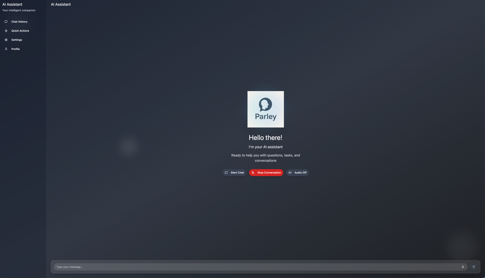
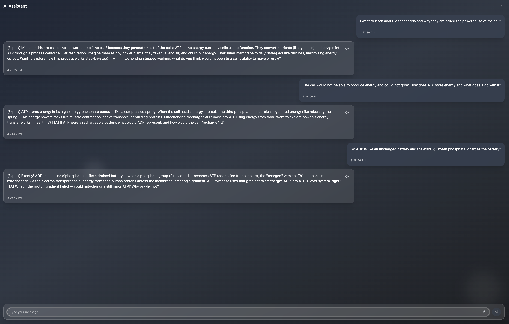

# Parley - AI Voice Tutoring Assistant 🎓🎙️

<div align="center">
  
</div>

## 🎯 Project Goals

Parley is an **adaptive educational AI tutor** that leverages voice interaction and the Feynman Technique to create an engaging, podcast-style learning experience. Our mission is to transform traditional tutoring into a dynamic conversation between students and AI educators.

### Core Objectives

- **🎤 Natural Voice Interaction**: Enable seamless voice-based learning through speech recognition and text-to-speech technology
- **🧠 Adaptive Teaching**: Implement intelligent role-switching between Expert (Professor) and TA personas based on student needs
- **📚 Feynman Technique Integration**: Guide students to learn by explaining concepts in their own words
- **🔄 Real-time Feedback**: Provide instant, streaming responses with audio output for an immersive learning experience
- **📖 Context-Aware Tutoring**: Support PDF document uploads to provide personalized tutoring based on study materials
- **🚫 Feedback Prevention**: Smart microphone management that prevents the AI's voice from being picked up during speech

## ✨ Key Features

### 🎙️ Voice-First Experience
- **Continuous Speech Recognition**: Always-on listening mode for natural conversation flow
- **Intelligent Audio Management**: Automatically mutes microphone when AI is speaking to prevent feedback loops
- **High-Quality TTS**: Natural-sounding voice responses using Google Cloud Text-to-Speech
- **Real-time Transcription**: Live display of speech-to-text conversion

### 🤖 Dual AI Personas
- **[Expert] Professor Mode**: Deep conceptual explanations, theory, and "why" questions
- **[TA] Tutor Mode**: Practical applications, problem-solving, and guided reasoning
- **Dynamic Role Switching**: AI automatically selects the appropriate persona based on context

### 📊 Adaptive Learning
- **Difficulty Adjustment**: Automatically adapts complexity based on student responses
- **Progress Tracking**: Monitors mastered topics and areas needing reinforcement
- **Metacognitive Prompts**: Encourages self-reflection and deeper understanding
- **Conversational Memory**: Maintains context across the entire tutoring session

### 💬 Modern Chat Interface
<div align="center">
  
</div>

- **Streaming Responses**: Real-time AI response rendering
- **Audio Playback Controls**: Replay any AI response with a single click
- **Conversation History**: Full session history with timestamps
- **Responsive Design**: Beautiful UI that works on desktop and mobile

## 🏗️ Technical Architecture

### Frontend (React + TypeScript)
- **Framework**: Vite + React 18 with TypeScript
- **UI Components**: shadcn/ui + Radix UI primitives
- **Styling**: TailwindCSS for modern, responsive design
- **Icons**: Lucide React
- **Real-time Communication**: Socket.IO client for WebSocket connections
- **Speech APIs**: Web Speech API for browser-based speech recognition

### Backend (Python)
- **Server**: Flask + SocketIO for WebSocket communication
- **LLM**: Cerebras AI for ultra-fast inference
- **Speech-to-Text**: Google Cloud Speech-to-Text API
- **Text-to-Speech**: Google Cloud Text-to-Speech API
- **PDF Processing**: PyPDF2 for document parsing
- **Session Management**: In-memory conversation history with unique session IDs

## 🚀 Getting Started

### Prerequisites

- **Node.js** (v18 or higher)
- **Python** (v3.8 or higher)
- **Google Cloud Account** (for Speech APIs)
- **Cerebras API Key**

### Frontend Setup

1. Install dependencies:
```bash
npm install
```

2. Start the development server:
```bash
npm run dev
```

The frontend will be available at `http://localhost:5173`

### Backend Setup

1. Navigate to the API directory:
```bash
cd api
```

2. Install Python dependencies:
```bash
pip install flask flask-socketio flask-cors langchain-cerebras google-cloud-speech google-cloud-texttospeech pypdf2 python-dotenv
```

3. Set up environment variables:
Create a `.env` file in the `api` directory:
```env
CEREBRAS_API_KEY=your_cerebras_api_key
GOOGLE_APPLICATION_CREDENTIALS=path/to/your/google-credentials.json
```

4. Start the backend server:
```bash
python server.py
```

The backend will run on `http://localhost:8501`

## 🎨 Design & UI

This project is based on the Figma design template:
**[AI Voice Assistant with Chat](https://www.figma.com/design/ZKNjj9FLh1ae8fpXrXFoQf/AI-Voice-Assistant-with-Chat--Copy---Community---Copy-)**

The UI implementation uses components from [shadcn/ui](https://ui.shadcn.com/) under the MIT license. See [Attributions](src/Attributions.md) for full credits.

## 🎯 How It Works

### Conversation Flow

1. **Student Speaks**: Microphone captures voice input via Web Speech API
2. **Transcription**: Speech is converted to text in real-time
3. **AI Processing**: 
   - Message sent to backend via WebSocket
   - Cerebras LLM generates response with appropriate persona
   - Response streams back to frontend in chunks
4. **Voice Output**: 
   - Text converted to speech via Google Cloud TTS
   - Audio automatically plays when ready
   - Microphone muted during playback to prevent feedback
5. **Resume Listening**: After AI finishes speaking, microphone automatically reactivates

### Feedback Prevention System

Parley implements a sophisticated audio management system:

- **Pre-playback Muting**: Speech recognition stops before AI audio plays
- **Post-playback Resumption**: Microphone reactivates 500ms after audio completes
- **AI Response Blocking**: Recognition paused during AI text generation
- **Queue Management**: Multiple audio chunks play sequentially without overlap

## 📁 Project Structure

```
Parley/
├── api/                      # Python backend
│   ├── server.py            # Flask + SocketIO server
│   ├── speech.py            # Speech-to-text and TTS engines
│   ├── prompts.py           # AI system prompts
│   └── config.py            # Configuration management
├── src/                      # React frontend
│   ├── components/
│   │   ├── ResponsiveAIAssistant.tsx  # Main app component
│   │   ├── ChatInterface.tsx          # Chat UI
│   │   └── ui/                        # shadcn/ui components
│   ├── assets/              # Images and static files
│   └── types/               # TypeScript type definitions
├── public/                   # Public assets and screenshots
└── package.json             # Frontend dependencies
```

## 🛠️ Technologies Used

### Frontend
- React 18
- TypeScript
- Vite
- TailwindCSS
- shadcn/ui
- Socket.IO Client
- Lucide Icons

### Backend
- Python 3.8+
- Flask
- Flask-SocketIO
- LangChain
- Cerebras AI
- Google Cloud Speech-to-Text
- Google Cloud Text-to-Speech
- PyPDF2

## 🎓 Educational Philosophy

Parley is built on proven learning principles:

- **Feynman Technique**: Learn by teaching and explaining concepts simply
- **Active Recall**: Engage students in retrieving information from memory
- **Spaced Repetition**: Reinforce concepts at optimal intervals
- **Metacognition**: Encourage students to think about their thinking
- **Adaptive Difficulty**: Match challenge level to student capability (Zone of Proximal Development)

## 🤝 Contributing

We welcome contributions! Whether it's:
- 🐛 Bug fixes
- ✨ New features
- 📝 Documentation improvements
- 🎨 UI/UX enhancements

Feel free to open issues or submit pull requests.

## 📄 License

This project uses components from shadcn/ui under the MIT License. See [Attributions](src/Attributions.md) for details.

## 🙏 Acknowledgments

- **Figma Template**: Original design from the Figma community
- **shadcn/ui**: Beautiful, accessible UI components
- **Cerebras**: Ultra-fast LLM inference
- **Google Cloud**: Speech recognition and synthesis APIs
- **Unsplash**: High-quality photography

---

<div align="center">
  <p><strong>Built with ❤️ for learners everywhere</strong></p>
  <p>Transform your learning experience with AI-powered voice tutoring</p>
</div>